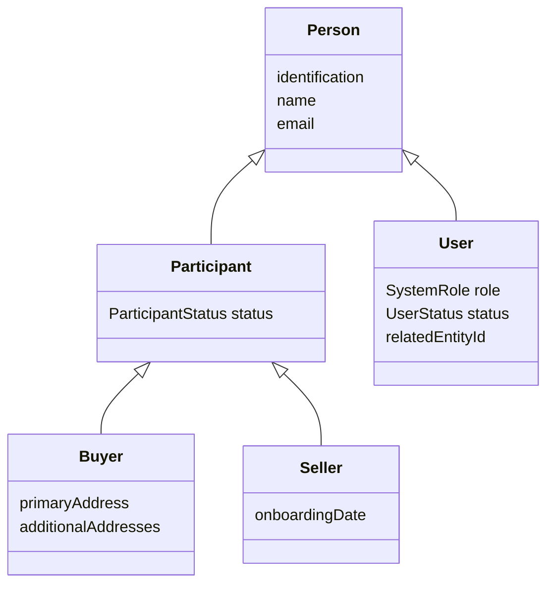
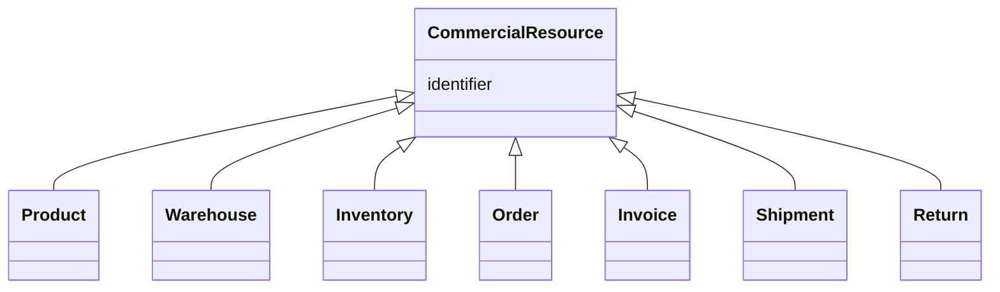

# NexusMarket - Domain Model

## 1. Purpose

This document describes the current domain model of NexusMarket. The model represents the main business concepts involved in a centralized marketplace where Buyers purchase products offered by Sellers, while system Users perform administrative, supervisory, and logistics operations.

The current implementation focuses on the domain layer. Application services, ports, adapters, persistence mappings, controllers, and detailed business workflows are not yet implemented.

---

## 2. Domain Structure

The current domain is organized into three packages:

```text
application
└── domain
    ├── models
    ├── valueobjects
    └── enums
```

- **models**: classes representing business entities or domain objects.
- **valueobjects**: controlled domain concepts such as statuses, types, and roles.
- **enums**: simple enumerations. The current implementation contains `AuditSeverity`.

---

## 3. Person and Participant Hierarchy

The model separates the identity of a person from the roles and commercial participation associated with that person.



### Person

`Person` is an abstract base class containing information shared by people in the system:

- identification
- name
- email

It does not represent a specific commercial or system role.

### Participant

`Participant` extends `Person` and represents people who participate commercially in the marketplace.

It adds:

- `ParticipantStatus status`

The current statuses are `ACTIVE` and `SUSPENDED`.

### Buyer

`Buyer` extends `Participant`.

It adds:

- `primaryAddress`
- `additionalAddresses`

A Buyer represents the customer who purchases products.

### Seller

`Seller` extends `Participant`.

It adds:

- `onboardingDate`

A Seller represents a commercial participant who offers products through the marketplace.

### User

`User` extends `Person`, but does not extend `Participant`.

It represents a system account used to operate the platform. Its current attributes are:

- `SystemRole role`
- `UserStatus status`
- `relatedEntityId`

This separation allows the model to distinguish a person's identity from the account's system permissions and status.

---

## 4. Commercial Resource Hierarchy

`CommercialResource` is an abstract base class for the main resources involved in marketplace operations.



Its current common attribute is:

- `identifier`

This identifier gives each commercial resource a way to be distinguished from other resources.

### Product

Represents a product offered by a Seller.

Current attributes:

- `Seller seller`
- `name`
- `description`
- `BigDecimal price`
- `ProductType productType`
- `List<String> variants`
- `ProductStatus productStatus`

### Warehouse

Represents a physical storage location.

Current attributes:

- `WarehouseOwnerType ownerType`
- `Seller ownerSeller`
- `address`

The owner type distinguishes Marketplace-owned warehouses from Seller-owned warehouses.

### Inventory

Represents the current stock state of a Product in a Warehouse.

Current attributes:

- `Product product`
- `Warehouse warehouse`
- `availableQuantity`
- `reservedQuantity`
- `List<InventoryMovement> movements`

Inventory therefore connects a product with a storage location and keeps the current quantities.

### InventoryMovement

Represents a specific change affecting an inventory record.

Current attributes:

- `Inventory inventory`
- `InventoryMovementType movementType`
- `quantity`
- `movementDate`
- `description`

It is intentionally not a `CommercialResource`: it represents a movement/event associated with inventory rather than a primary commercial resource.

### Order

Represents a purchase order made by a Buyer.

Current attributes:

- `Buyer buyer`
- `creationDate`
- `OrderStatus orderStatus`
- `totalAmount`

`OrderStatus` represents the order lifecycle currently modeled as:

```text
CART
→ PENDING_PAYMENT
→ PAID
→ DISPATCHED
→ DELIVERED
```

### OrderItem

Represents one product line within an Order.

Current attributes:

- `Order order`
- `Product product`
- `quantity`
- `unitPrice`

`OrderItem` is a model object but is not a `CommercialResource`, because it represents a component of an Order rather than an independently identified commercial resource.

### Invoice

Represents the billing record associated with an Order.

Current attributes:

- `Order order`
- `issueDate`
- `totalAmount`
- `InvoiceStatus invoiceStatus`

### Shipment

Represents the logistics process associated with an Order.

Current attributes:

- `Order order`
- `Warehouse originWarehouse`
- `dispatchDate`
- `ShipmentStatus shipmentStatus`

### Return

Represents a return associated with an Order.

Current attributes:

- `Order order`
- `reason`
- `refundedAmount`
- `ReturnStatus returnStatus`

---

## 5. Operational and Audit Models

### Operation

`Operation` represents an operational action performed by a system User.

Current attributes:

- `operationId`
- `OperationType operationType`
- `executionDate`
- `User performedBy`
- `CommercialResource affectedResource`

It is not a `CommercialResource` because it represents an action performed on a resource.

### AuditLog

`AuditLog` represents an audit record of an operation.

Current attributes:

- `auditId`
- `OperationType operationType`
- `operationDate`
- `User performedBy`
- `SystemRole userRole`
- `CommercialResource affectedResource`
- `Map<String, Object> details`

The current model also contains the `AuditSeverity` enum. However, `AuditLog` does not currently contain a `severity` attribute, so the enum is not directly connected to this class in the current implementation.

---

## 6. Main Domain Relationships

The current implementation expresses the following important relationships:

```text
Person
├── Participant
│   ├── Buyer
│   └── Seller
└── User

CommercialResource
├── Product
├── Warehouse
├── Inventory
├── Order
├── Invoice
├── Shipment
└── Return

Product ─────── Seller
Inventory ───── Product
Inventory ───── Warehouse
Inventory ───── InventoryMovement
InventoryMovement ───── InventoryMovementType

Order ───── Buyer
OrderItem ───── Order
OrderItem ───── Product

Invoice ───── Order
Shipment ───── Order
Shipment ───── Warehouse
Return ───── Order
```

---

## 7. Current Domain Scope

The current code is intentionally limited to the domain model and its controlled values.

The following are **not yet implemented as application behavior**:

- application services
- domain services
- ports
- adapters
- REST controllers
- database repositories
- JPA mappings
- MongoDB persistence
- authentication implementation
- Postman/API workflows
- complete business rule enforcement

These are expected to be developed in later stages.

---

## 8. Domain Design Decisions

### Cart

There is currently no separate `Cart` model. The concept of a cart is represented by:

```text
OrderStatus.CART
```

Therefore, the current design treats a cart as an early state of an Order rather than as a separate domain class.

### InventoryMovement

`InventoryMovement` was added to give `InventoryMovementType` a concrete domain object to classify. This creates a clear distinction:

```text
Inventory
= current stock state

InventoryMovement
= a concrete change to that stock

InventoryMovementType
= classification of that change
```

### Payment and Refund

There are currently no separate `Payment` or `Refund` model classes. Payment progress is represented through `OrderStatus`, while refund information is currently represented in `Return` through `refundedAmount` and `ReturnStatus`.

These decisions can be revisited if later requirements require independent payment or refund information.

---

## 9. Summary

The current domain separates:

1. **People and system accounts**
2. **Commercial participants**
3. **Commercial resources**
4. **Inventory state and inventory movements**
5. **Orders and order items**
6. **Billing, shipping, and returns**
7. **Operational actions and audit records**
8. **Controlled domain values**

The model is currently structured as a domain-first design and is ready to be extended with application behavior in later iterations.
